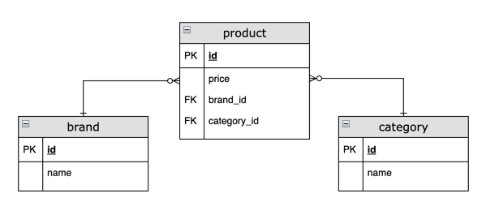

# product

## 개발환경
- Kotlin
- JDK 21
- Spring Boot 3
- Spring Data JPA
- QueryDSL
- H2
- Kotest

## 프로젝트 구조
### product-api
- 상품 서비스를 담당하는 API 모듈
- port: 8080

### product-manager
- 상품 관리를 담당하는 API 모듈
- port: 8090

### product-domain-rdb
- 상품 데이터베이스 연결을 담당하는 모듈
- product-api, product-manager 모듈에서 의존

## 코드 빌드, 테스트, 실행

### product-api
```shell
# 빌드
./gradlew product-api:build

# 테스트
./gradlew product-api:test

# 실행
./gradlew product-api:bootRun
```

### product-manager
```shell
#빌드
./gradlew product-manager:build

# 테스트
./gradlew product-manager:test

# 실행
./gradlew product-manager:bootRun
```

## ERD


## API 명세

### product-api

**카테고리 별 최저가 브랜드와 상품가격, 총액 조회 API**
```shell
curl --location 'http://localhost:8080/api/product/coordinator/category/min-price'
```

**단일 브랜드로 모든 카테고리 상품을 구매할 때 최저가격에 판매하는 브랜드와 카테고리의 상품가격, 총액 조회 API**
```shell

curl --location 'http://localhost:8080/api/product/coordinator/cheapest/brand'
```

**카테고리 이름으로 최저가, 최고가 브랜드와 상품 가격 조회 API**
```shell
curl --location 'http://localhost:8080/api/product/price/max-min?categoryName={categoryName}'
```

### product-manager

**브랜드 추가 API**
```shell
curl --location 'localhost:8090/manager/brands' \
--header 'Content-Type: application/json' \
--data '{
    "name" : "Z"
}'
```

**브랜드 수정 API**
```shell
curl --location --request PUT 'localhost:8090/manager/brands' \
--header 'Content-Type: application/json' \
--data '{
    "id": "1",
    "name" : "Y"
}'
```

**브랜드 삭제 API**
```shell
curl --location --request DELETE 'localhost:8090/manager/brands' \
--header 'Content-Type: application/json' \
--data '{
    "id" : 1
}'
```

**상품 추가 API**
```shell
curl --location 'localhost:8090/manager/products' \
--header 'Content-Type: application/json' \
--data '{
    "brandId": 10,
    "categoryId": 10,
    "price": 1
}'
```

**상품 수정 API**
```shell
curl --location --request PUT 'localhost:8090/manager/products' \
--header 'Content-Type: application/json' \
--data '{
    "productId" : 1,
    "brandId": 1,
    "categoryId": 1,
    "price": 1
}'
```

**상품 삭제 API**
```shell
curl --location --request DELETE 'localhost:8090/manager/products'
```